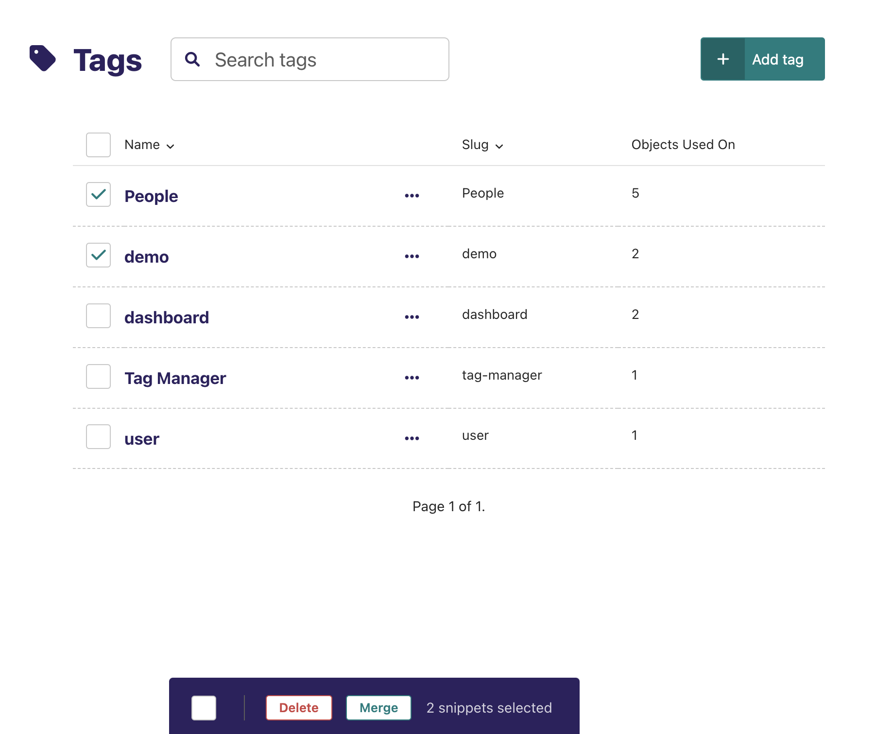
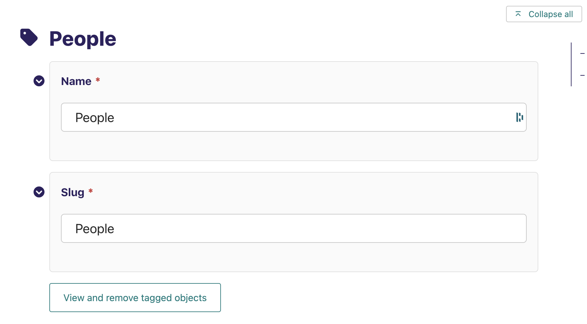
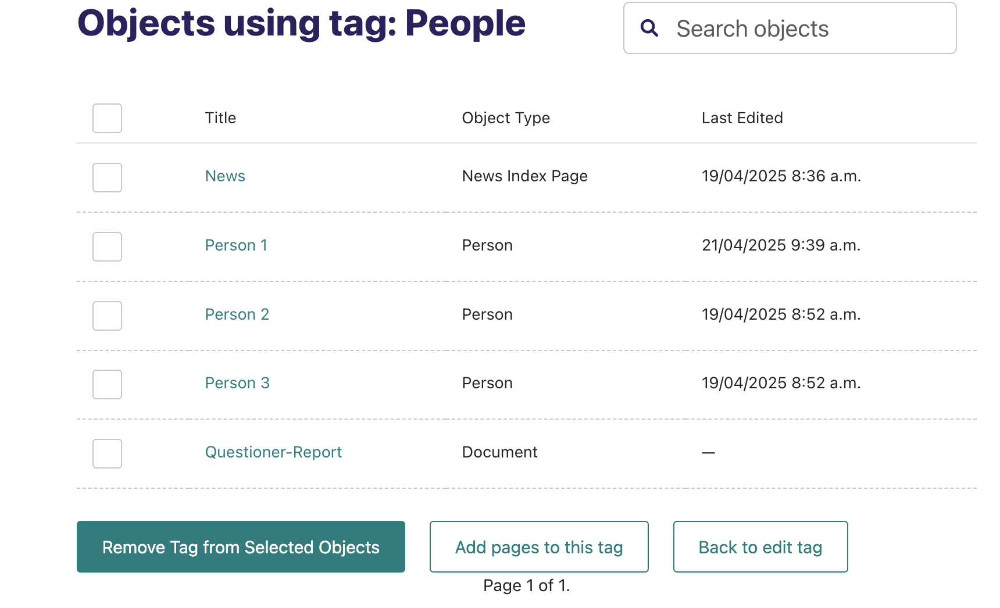
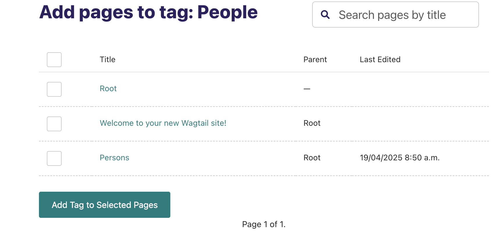

# Wagtail Tag Manager

**Wagtail Tag Manager** is an admin interface for managing tag usage across your Wagtail site:

- View and manage all objects (Page, Image, Document, etc.) using a given tag
- Works across Pages, Documents, Images, and other tagged models that use `django-taggit`
- Add or remove tags from multiple object types
- Bulk merge and delete tags
- Add multiple pages to a given tag
- Edit tag names and slugs
- Compatible with custom tag models and page models


## Installation

1. Install via pip:

    ```
    pip install wagtail-tagmanager
    ```

2. Add to your `INSTALLED_APPS`:

    ```python
    INSTALLED_APPS = [
        ...
        "wagtail_tagmanager",
    ]
    ```

3. Configure your settings:

   - Specify the model you use that inherits from `TaggedItemBase`. If you use tags for pages, you would have set this up. More information [here](https://docs.wagtail.org/en/latest/advanced_topics/tags.html#adding-tags-to-a-page-model). **You must define this setting to use this tag manager** :

     ```python
      WAGTAIL_TAGMANAGER_PAGE_TAG_MODEL = "yourapp.BlogPageTag"
     ```

    - If you want to be able add pages to a specific tag in bulk, specify the page model you want to add tags to. If you want to add tags to all pages, set it to your first concrete model that inherits Page. **You must define this setting to add pages to a tag**

      ```python
      WAGTAIL_TAGMANAGER_BASE_PAGE_MODEL = "yourapp.BlogPage"
      ```

### Usage
Once installed, go to the "Tags" section in the Wagtail admin.

There are four main views:

## Tag Index View
- View all tags in the project and how many objects are tagged with each tag
- Add and Delete tags
- Merge multiple tags into one
- Click each tag to go to Tag Edit View



## Tag Edit View
- Edit tag Name and Slug
- Button to view all objects tagged with that tag



## Manage Tags View
- View and search all objects tagged with that Tag
- Remove the tag from multiple objects
- Button to add pages to this tag (Note: This button only appears if `WAGTAIL_TAGMANAGER_BASE_PAGE_MODEL` is defined)



##  Add Pages to Tag View
- Add pages in bulk to the specified tag
- Search for a specific page by title



### Known Issues

- The object count for each tag will count objects even if their model was deleted (since deleting a model does not delete it's corresponding `ContentType`). This can lead to incorrect object counts on the Tag Index Page. This `model` is defined in the `ContentType` model

### Contributing

If you would like to contribute, feel free to create a pull request. Some notes about contributing:
  - You will need to create a virtual env and run `pip install -r requirements.txt`
  - `pre-commit install` to install the formatting checker
  - run `python3 runtests.py` to run the tests
  - Please run `ruff format` and `ruff check --fix` to format your code before committing. If you forget, `pre-commit` will throw the error `Git: [WARNING] Unstaged files detected` when committing to remind you.